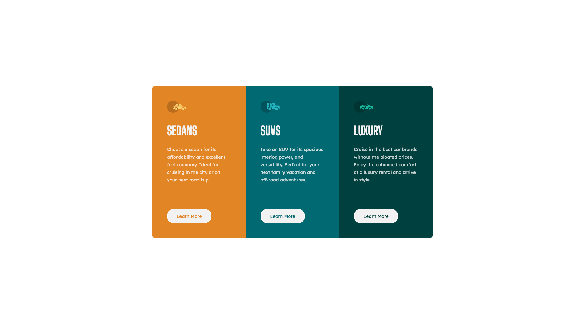

# Frontend Mentor - 3-column preview card component solution

This is a solution to the [3-column preview card component challenge on Frontend Mentor](https://www.frontendmentor.io/challenges/3column-preview-card-component-pH92eAR2-). Frontend Mentor challenges help you improve your coding skills by building realistic projects. 

## Table of contents

- [Overview](#overview)
  - [The challenge](#the-challenge)
  - [Screenshot](#screenshot)
  - [Links](#links)
- [My process](#my-process)
  - [Built with](#built-with)
- [Author](#author)

## Overview

### The challenge

Users should be able to:

- View the optimal layout depending on their device's screen size
- See hover states for interactive elements

### Screenshot

### Links

- Live Site URL: [https://antoru-3-column-preview-card-componen.netlify.app/](https://antoru-3-column-preview-card-componen.netlify.app/)

## My process

### Built with

- [React](https://react.dev/) - UI Library
- Semantic HTML5 markup
- CSS custom properties
- Flexbox
- [Sass](https://sass-lang.com/) - For styles
- [Bem](https://en.bem.info/) - For classes's naming

### Deploying the project

Project hosted for free, thanks to:

- [Netlify](https://www.netlify.com/)

## Author

- Linkedin - [https://www.linkedin.com/in/antoru/](https://www.linkedin.com/in/antoru/)
- Frontend Mentor - [https://www.frontendmentor.io/profile/antoru](https://www.frontendmentor.io/profile/antoru)